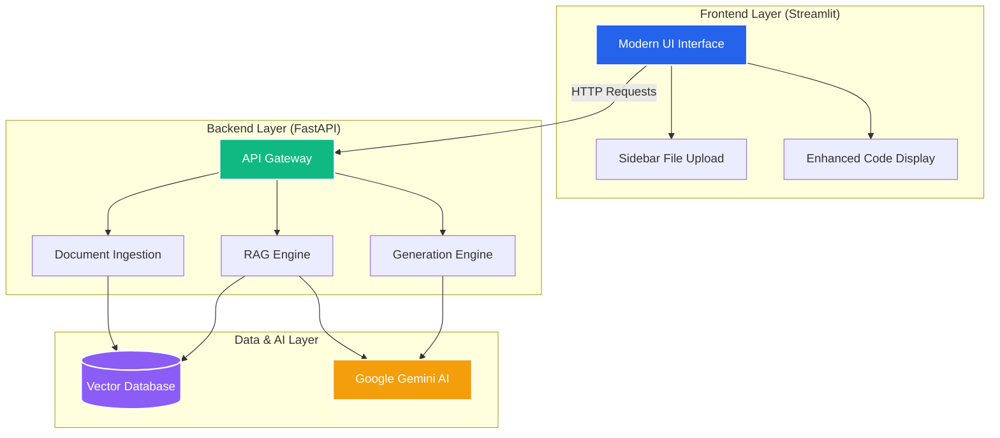

# 🤖 Autonomous QA Agent

[](https://www.python.org/downloads/)
[](https://fastapi.tiangolo.com/)
[](https://streamlit.io/)
[](https://opensource.org/licenses/MIT)
[](https://render.com)

**Transform your documentation into comprehensive test cases and automation scripts using AI.**

The **Autonomous QA Agent** is an intelligent testing platform that leverages Google's Gemini AI and semantic document processing to automate the Quality Assurance workflow. It parses your requirements, generates context-aware test cases, and builds ready-to-run Selenium automation scripts.

---

## ✨ Key Features

- **🧠 AI-Powered Generation**: Uses Google Gemini to understand context and generate relevant test scenarios.
- **📄 Smart Document Processing**: Supports `.md`, `.txt`, `.pdf`, `.json`, and `.html` files.
- **🔍 Semantic Search**: Built-in vector database (ChromaDB) for accurate information retrieval.
- **🤖 Selenium Automation**: Automatically generates Python Selenium scripts with syntax highlighting.
- **🎨 Modern UI**: A clean, minimalist interface with dark mode support and enhanced code display.
- **⚡ Real-time Analytics**: Track knowledge base chunks, generated tests, and system health.

---

## 🏗️ System Architecture

The system follows a modern microservices architecture, separating the frontend user interface from the backend processing engine.



### 🔄 Data Flow

1.  **Ingestion**: Documents are uploaded, parsed, chunked, and embedded into the Vector Database.
2.  **Retrieval**: User queries trigger a semantic search to find relevant context from the knowledge base.
3.  **Generation**: The LLM uses the retrieved context to generate detailed test cases.
4.  **Automation**: Selected test cases are converted into executable Selenium Python scripts.

---

## 🛠️ Technology Stack

-   **Frontend**: Streamlit (Python)
-   **Backend**: FastAPI (Python)
-   **AI Model**: Google Gemini Pro / Flash
-   **Vector DB**: ChromaDB (with SimpleVectorDB fallback)
-   **Automation**: Selenium WebDriver
-   **Deployment**: Render (Backend) + Streamlit Cloud (Frontend)

---

## 🚀 Quick Start

### Prerequisites

-   Python 3.9+
-   Google Gemini API Key

### Installation

1.  **Clone the repository**
    ```bash
    git clone https://github.com/nimish1402/Autonomous_QA_Generator.git
    cd Autonomous_QA_Generator
    ```

2.  **Set up environment**
    ```bash
    python -m venv venv
    # Windows
    venv\Scripts\activate
    # Mac/Linux
    source venv/bin/activate
    ```

3.  **Install dependencies**
    ```bash
    pip install -r requirements.txt
    ```

4.  **Configure Environment**
    Create a `.env` file in the root directory:
    ```env
    GEMINI_API_KEY=your_api_key_here
    ENVIRONMENT=development
    BACKEND_URL=http://localhost:8000
    ```

### Running the Application

1.  **Start the Backend**
    ```bash
    cd backend
    python main.py
    ```
    *Server starts at http://localhost:8000*

2.  **Start the Frontend** (in a new terminal)
    ```bash
    cd frontend
    streamlit run app_enhanced.py
    ```
    *App opens at http://localhost:8501*

---

## 📖 Usage Guide

1.  **Upload Documents**: Use the sidebar to upload your requirements (PDF, MD, TXT) and HTML files.
2.  **Build Knowledge Base**: Click "Build Knowledge Base" to process files.
3.  **Generate Tests**: Go to the "Generate Tests" tab, enter a query (e.g., "Verify login functionality"), and click Generate.
4.  **Create Scripts**: Switch to "Create Scripts", select a generated test case, and generate the Selenium code.
5.  **Download**: Download the generated Python script and run it locally.

---

## 📂 Project Structure

```
autonomous-qa-agent/
├── backend/                # FastAPI Backend
│   ├── main.py            # Entry point
│   └── vectordb/          # Vector storage
├── frontend/               # Streamlit Frontend
│   └── app_enhanced.py    # Modern UI Application
├── utils/                  # Core Utilities
│   ├── document_parser.py # File parsing logic
│   └── vector_database.py # Embedding management
├── models/                 # AI Models
│   └── llm_agent.py       # Gemini integration
└── requirements.txt        # Dependencies
```

---

## 🤝 Contributing

Contributions are welcome! Please feel free to submit a Pull Request.

## 📄 License

This project is licensed under the MIT License.