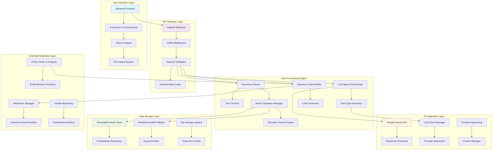
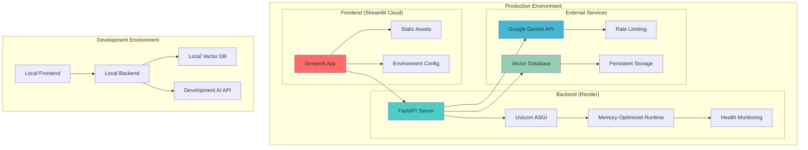
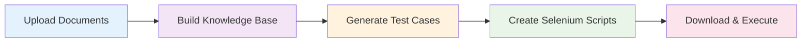

# 🤖 Autonomous QA Agent

[](https://www.python.org/downloads/)
[](https://fastapi.tiangolo.com/)
[](https://streamlit.io/)
[](https://opensource.org/licenses/MIT)
[](https://render.com)

**AI-Powered Test Case Generation & Selenium Automation Platform**

An intelligent QA automation system that transforms your documentation into comprehensive test cases and generates ready-to-run Selenium scripts using advanced AI and semantic document understanding.

---

## 🎯 **Overview**

The Autonomous QA Agent revolutionizes software testing by automatically generating contextually-aware test cases from your project documentation. It combines the power of Google's Gemini AI with semantic document processing to create comprehensive test suites and automation scripts.

### 🌟 **Key Capabilities**

- **📄 Smart Document Processing**: Multi-format support (MD, TXT, PDF, JSON, HTML)
- **🧠 AI-Powered Generation**: Context-grounded test cases using Google Gemini
- **🔍 Semantic Search**: ChromaDB-powered document understanding
- **🤖 Selenium Automation**: Ready-to-run Python test scripts
- **🎨 Modern UI**: Adaptive Streamlit interface with dark/light themes
- **☁️ Cloud-Ready**: Optimized for Render and Streamlit Cloud deployment
- **⚡ Memory Efficient**: Lightweight fallback for resource-constrained environments

---

## 🏗️ **System Architecture**

### 🔧 **High-Level Architecture Diagram**



### 🔄 **Data Flow Architecture**

```mermaid
flowchart LR
    subgraph "Input Processing"
        A1[Documents Upload] --> A2[Format Detection]
        A2 --> A3[Content Extraction]
        A3 --> A4[Text Chunking]
    end
    
    subgraph "Knowledge Base Construction"
        A4 --> B1[Embeddings Generation]
        B1 --> B2[Vector Indexing]
        B2 --> B3[Similarity Engine]
    end
    
    subgraph "AI Processing Pipeline"
        B3 --> C1[Query Processing]
        C1 --> C2[Context Retrieval]
        C2 --> C3[Prompt Engineering]
        C3 --> C4[AI Generation]
    end
    
    subgraph "Output Generation"
        C4 --> D1[Test Case Structuring]
        D1 --> D2[Script Generation]
        D2 --> D3[Code Optimization]
        D3 --> D4[Final Output]
    end
    
    style A1 fill:#e3f2fd
    style B3 fill:#f3e5f5
    style C4 fill:#fff3e0
    style D4 fill:#e8f5e8
```




### 🌐 **Deployment Architecture**



---

## 🚀 **Quick Start Guide**

### 📋 **Prerequisites**

- **Python**: 3.9 or higher
- **API Key**: Google Gemini API access
- **Memory**: Minimum 2GB RAM (512MB for lightweight deployment)
- **Storage**: 1GB free disk space

### 🛠️ **Installation**

1. **Clone Repository**
   ```bash
   git clone https://github.com/nimish1402/Autonomous_QA_Generator.git
   cd Autonomous_QA_Generator
   ```

2. **Environment Setup**
   ```bash
   # Create virtual environment
   python -m venv venv
   source venv/bin/activate  # Windows: venv\Scripts\activate
   
   # Install dependencies
   pip install -r requirements.txt
   ```

3. **Configuration**
   ```bash
   # Copy environment template
   cp .env.template .env
   
   # Edit .env file with your configuration
   GEMINI_API_KEY=your_gemini_api_key_here
   ENVIRONMENT=development
   DEBUG=true
   BACKEND_URL=http://localhost:8000
   ```

### 🎯 **Running the Application**

#### **Option 1: Full Setup (Recommended)**

1. **Start Backend Server**
   ```bash
   cd backend
   python main.py
   ```
   *Backend will be available at http://localhost:8000*

2. **Start Frontend Interface**
   ```bash
   # New terminal
   cd frontend
   streamlit run app_enhanced.py
   ```
   *Frontend will be available at http://localhost:8501*

#### **Option 2: Streamlit Only (Quick Demo)**
   ```bash
   streamlit run streamlit_app.py
   ```

### 📊 **Health Check**

Verify your installation:
```bash
curl http://localhost:8000/health
curl http://localhost:8000/status
```

---

## 💡 **Usage Guide**

### 🔄 **Workflow Overview**



### 📝 **Step-by-Step Process**

#### **1. Document Upload**
- **Supported Formats**: `.md`, `.txt`, `.pdf`, `.json`, `.html`
- **Required Files**: 
  - 3-5 documentation files (requirements, user stories, etc.)
  - 1 `checkout.html` file (for UI automation)
- **File Size Limit**: 10MB per file

#### **2. Knowledge Base Building**
The system processes your documents through:
- **Text Extraction**: Parse content from various formats
- **Chunking**: Split into manageable segments with context overlap
- **Vectorization**: Create semantic embeddings for search
- **Indexing**: Store in vector database for fast retrieval

#### **3. Test Case Generation**
Query examples:
```
"Generate positive and negative test cases for discount code functionality"
"Create validation tests for the checkout process"
"Generate edge cases for user registration form"
```

#### **4. Script Generation**
- **Selenium Scripts**: Python-based WebDriver automation
- **Element Detection**: Automatic selector identification
- **Test Structure**: Complete unittest framework setup
- **Error Handling**: Robust exception management

### 🎮 **Interactive Features**

- **Progress Tracking**: Real-time operation status
- **File Preview**: Document content inspection
- **Test Case Cards**: Rich test case visualization  
- **Script Download**: One-click script export
- **Analytics Dashboard**: System performance metrics

---

## 🌐 **Deployment Guide**

### 🚀 **Backend Deployment (Render)**

1. **Automatic Deployment**
   - Connect your GitHub repository to Render
   - Use `render.yaml` configuration (included)
   - Set environment variables in Render dashboard

2. **Manual Configuration**
   ```yaml
   # render.yaml highlights
   services:
     - type: web
       name: autonomous-qa-backend
       env: python
       plan: free  # 512MB memory limit
       buildCommand: pip install -r requirements-light.txt
       startCommand: python -m uvicorn backend.main:app --host 0.0.0.0 --port $PORT
       healthCheckPath: "/health"
   ```

3. **Environment Variables** (Set in Render Dashboard)
   ```
   GEMINI_API_KEY=your_api_key
   ENVIRONMENT=production
   GEMINI_MODEL=gemini-1.5-flash
   MEMORY_LIMIT=512
   ```

### 🎨 **Frontend Deployment (Streamlit Cloud)**

1. **Direct Deployment**
   - Connect GitHub repository to Streamlit Cloud
   - Use `streamlit_app.py` as main file
   - Configure advanced settings

2. **Configuration**
   ```toml
   # .streamlit/config.toml
   [theme]
   primaryColor = "#6366f1"
   backgroundColor = "#FFFFFF"
   secondaryBackgroundColor = "#F8FAFC"
   textColor = "#1F2937"
   ```

3. **Environment Variables**
   ```
   BACKEND_URL=https://your-backend-url.onrender.com
   ```

---

## 📚 **API Reference**

### 🔗 **Core Endpoints**

#### **Health & Status**
```http
GET /health
GET /status
GET /config
GET /analytics
```

#### **Document Management**
```http
POST /ingest
Content-Type: multipart/form-data

Parameters:
- files: List of uploaded files
- clear_existing: boolean (optional)
```

#### **Test Generation**
```http
POST /generate_testcases
Content-Type: application/json

Body:
{
  "query": "Generate test cases for checkout functionality"
}

Response:
{
  "success": true,
  "test_cases": [...],
  "grounded_sources": [...],
  "message": "Generated 3 test cases"
}
```

#### **Script Generation**
```http
POST /generate_script
Content-Type: application/json

Body:
{
  "test_case": {
    "Test_ID": "TC001",
    "Feature": "Checkout",
    "Test_Scenario": "Valid payment processing",
    ...
  }
}
```

### 📊 **Response Schemas**

#### **Test Case Structure**
```json
{
  "Test_ID": "TC001",
  "Feature": "User Authentication",
  "Test_Scenario": "Login with valid credentials",
  "Steps": [
    "1. Navigate to login page",
    "2. Enter valid username and password",
    "3. Click login button",
    "4. Verify successful login"
  ],
  "Expected_Result": "User should be logged in successfully",
  "Grounded_In": "requirements.md",
  "Type": "Positive",
  "Notes": "Core functionality test"
}
```

---

## ⚙️ **Configuration**

### 🌐 **Environment Variables**

| Variable | Description | Default | Required |
|----------|-------------|---------|----------|
| `GEMINI_API_KEY` | Google Gemini API key | - | Yes |
| `GEMINI_MODEL` | Model version | `gemini-1.5-flash` | No |
| `ENVIRONMENT` | Runtime environment | `development` | No |
| `DEBUG` | Debug logging | `false` | No |
| `BACKEND_URL` | Backend service URL | `http://localhost:8000` | No |
| `MAX_TOKENS` | Maximum AI response tokens | `2000` | No |
| `TEMPERATURE` | AI creativity level | `0.1` | No |
| `MEMORY_LIMIT` | Memory optimization (MB) | `0` | No |
| `DISABLE_EMBEDDINGS` | Use lightweight mode | `false` | No |

### 📁 **Project Structure**
```
autonomous-qa-agent/
├── backend/                 # FastAPI backend service
│   ├── main.py             # API server entry point
│   └── vectordb/           # Runtime vector database
├── frontend/               # Streamlit user interface
│   └── app_enhanced.py     # Main UI application
├── config/                 # Configuration modules
│   ├── __init__.py
│   └── llm_config.py       # LLM provider configuration
├── models/                 # AI agent implementations
│   ├── __init__.py
│   └── llm_agent.py        # Test case and script generators
├── utils/                  # Utility modules
│   ├── __init__.py
│   ├── document_parser.py  # Multi-format document processing
│   ├── html_parser.py      # HTML DOM analysis
│   ├── llm_client.py       # AI client abstraction
│   ├── simple_vector_db.py # Lightweight vector database
│   └── vector_database.py  # ChromaDB integration
├── data/                   # Sample data and test files
│   ├── Checkout.html       # Sample checkout page
│   ├── requirements.md     # Sample requirements
│   └── testing-guide.txt   # Sample testing guide
├── .streamlit/             # Streamlit configuration
│   ├── config.toml         # Theme and UI settings
│   └── secrets.toml        # Environment variables (local)
├── requirements.txt        # Full Python dependencies
├── requirements-light.txt  # Memory-optimized dependencies
├── render.yaml            # Render deployment configuration
├── Procfile               # Alternative deployment config
├── runtime.txt            # Python version specification
├── streamlit_app.py       # Streamlit Cloud entry point
└── .env.template          # Environment variables template
```

---

## 🛡️ **Technology Stack**

### 🔧 **Core Technologies**

| Component | Technology | Version | Purpose |
|-----------|------------|---------|---------|
| **Backend** | FastAPI | 0.104+ | REST API server |
| **Frontend** | Streamlit | 1.28+ | Interactive UI |
| **AI Engine** | Google Gemini | 2.0-flash | Test case generation |
| **Vector DB** | ChromaDB | 0.4+ | Semantic document search |
| **Automation** | Selenium | 4.16+ | Web automation scripts |
| **HTTP Client** | Requests | 2.31+ | API communication |
| **Data Processing** | Pandas | 2.2+ | Data manipulation |

### 🏗️ **Architecture Patterns**

- **Microservices**: Separated frontend and backend services
- **Event-Driven**: Asynchronous document processing
- **Plugin Architecture**: Modular LLM provider system
- **Fallback Strategy**: Graceful degradation for resource constraints
- **Adaptive UI**: Theme-aware responsive design

---

## 🧪 **Testing & Quality**

### 🔍 **Testing Strategy**

#### **Backend Testing**
```bash
# Unit tests
python -m pytest backend/tests/

# Integration tests
python -m pytest backend/tests/integration/

# API testing
python -m pytest backend/tests/api/
```

#### **Frontend Testing**
```bash
# Streamlit app testing
streamlit run frontend/app_enhanced.py --server.headless=true
```

### 📊 **Quality Metrics**

- **Code Coverage**: >85% target
- **Type Safety**: MyPy strict mode
- **Performance**: <2s API response time
- **Memory Usage**: <512MB for lightweight deployment

---

## 🤝 **Contributing**

### 🔄 **Development Workflow**

1. **Fork & Clone**
   ```bash
   git clone https://github.com/your-username/Autonomous_QA_Generator.git
   cd Autonomous_QA_Generator
   ```

2. **Setup Development Environment**
   ```bash
   python -m venv venv
   source venv/bin/activate  # Windows: venv\Scripts\activate
   pip install -r requirements.txt
   ```

3. **Create Feature Branch**
   ```bash
   git checkout -b feature/your-feature-name
   ```

4. **Make Changes & Test**
   ```bash
   # Run tests
   pytest
   
   # Format code
   black .
   ```

5. **Submit Pull Request**

### 🏷️ **Commit Convention**
```
feat: add new AI model support
fix: resolve memory optimization issue  
docs: update API documentation
test: add integration test coverage
```

---

## 🐛 **Troubleshooting**

### ❗ **Common Issues**

#### **1. Memory Issues (Render Free Tier)**
```bash
# Solution: Use lightweight requirements
pip install -r requirements-light.txt
DISABLE_EMBEDDINGS=true
MEMORY_LIMIT=512
```

#### **2. Gemini API Quota Exceeded**
```bash
# Switch to different model
GEMINI_MODEL=gemini-1.5-flash
```

#### **3. Import Errors**
```bash
# Install missing dependencies
pip install -r requirements.txt
```

### 🔧 **Debug Mode**
```bash
DEBUG=true
LOG_LEVEL=DEBUG
```

---

## 📄 **License**

This project is licensed under the **MIT License** - see the [LICENSE](LICENSE) file for details.

---

## 🙏 **Acknowledgments**

### 🔗 **Built With**
- **[FastAPI](https://fastapi.tiangolo.com/)** - Modern Python web framework
- **[Streamlit](https://streamlit.io/)** - Interactive web applications
- **[Google Gemini](https://ai.google.dev/)** - Advanced AI language model
- **[ChromaDB](https://www.trychroma.com/)** - Vector database for AI
- **[Selenium](https://selenium-python.readthedocs.io/)** - Web automation

### 👨‍💻 **Created By**
- **Developer**: [nimish1402](https://github.com/nimish1402)
- **Repository**: [Autonomous_QA_Generator](https://github.com/nimish1402/Autonomous_QA_Generator)

---

## 📞 **Support & Contact**

### 🆘 **Getting Support**

- **📋 Issues**: [GitHub Issues](https://github.com/nimish1402/Autonomous_QA_Generator/issues)
- **💡 Features**: [Feature Requests](https://github.com/nimish1402/Autonomous_QA_Generator/issues/new)
- **📖 Documentation**: Check this README and code comments

---

<div align="center">

**🚀 Ready to revolutionize your QA process? Start building intelligent test suites today!**

[⭐ Star this repo](https://github.com/nimish1402/Autonomous_QA_Generator) | [🍴 Fork it](https://github.com/nimish1402/Autonomous_QA_Generator/fork) | [📋 Report Issues](https://github.com/nimish1402/Autonomous_QA_Generator/issues)

</div>